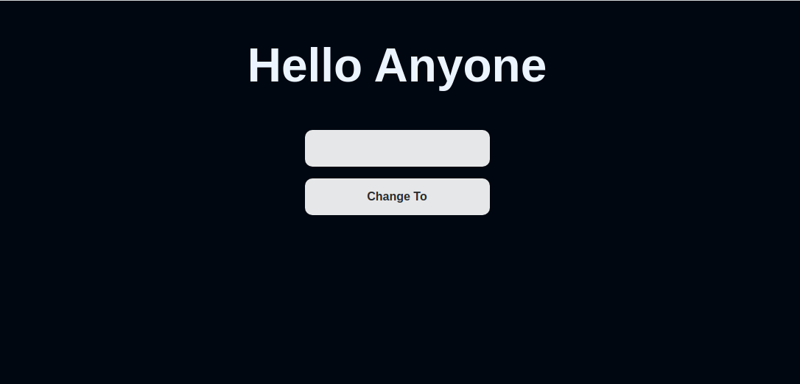

# Example Project for Web3 with Angular

This project shows how you can interact with ethereum smart contracts!

The project uses: 
- Hardhat
- Web3Js
- Angular

## Hardhat

...

## Frontend

Look into [examplefrontend](./examplefrontend/README.md) for more information and tutorials.

